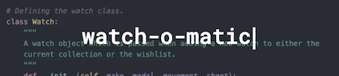

# 

I'm a software developer with a strong foundation in technical problem-solving, precision, and project management. Bringing a unique blend of creativity, technical craftsmanship, and a proven ability to learn and adapt quickly to new technologies, I love making things both in the digital and analogue world.

Before embarking on my developer career I've previously had 18 years experience in the creative industry as an Architectural modelmaker, see my portfolio of everything [here](https://apeskinian.github.io/)!

## I'm currently...
1. Seeking my first role as a developer
2. Learning React with Udemy
3. Learning Japanese
4. Training to ride London to Brighton in June 2025

## I like...
1. Watches
2. Cycling
4. Fortnite | Minecraft | Stardew Valley
5. Board Games
3. Lego

## I want to...
1. Continue learning German
3. Learn C#
4. Learn Swift

### Portfolio Projects for Diploma

### Programming Languages

### Frameworks | Libraries | APIs

### Version Control | IDEs

### Hosting

### Databases

### Design

### Manufacture

### Productivity

### Socials

